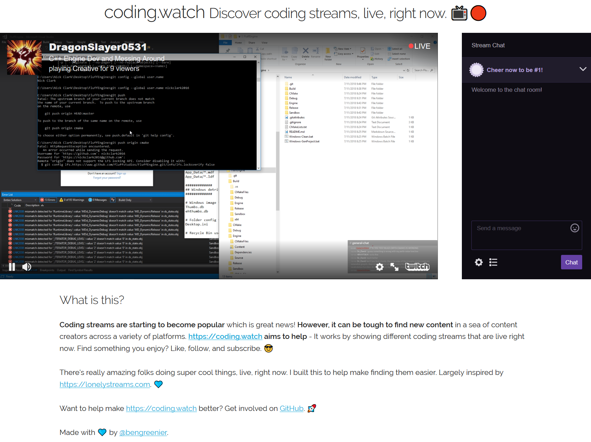

# coding.watch

Discover coding streams, live, right now 📺🔴



Coding streams are starting to become popular which is great news! However, it can be tough to find new content in a sea of content creators across a variety of platforms.
https://coding.watch aims to help - It works by showing different coding streams that are live __right now__. Find something you enjoy? Like, follow, and subscribe. 😎

There's really amazing folks doing super cool things, live, right now. I built this to help make finding them easier. Largely inspired by https://lonelystreams.com. 💙

## Deployment

This service might be a little confusing at first. This section talks about how it is built and deployed.

### How it works

- This repo has a [docs folder](./docs).
- It is built and hosted as a [github pages](https://pages.github.com) page.
- https://coding.watch points to it.
- This remainder of the repo defines an Azure function that is hosted on [Azure](https://azure.com).
- https://api.coding.watch points to it.
- https://coding.watch calls https://api.coding.watch.
- Happiness ensues.

### Deploying the function

> Note: this relies on the `serverless-azure-functions` plugin, and therefore, before you can deploy, you simply need to run `npm install`.

First, you must get a Twitch API key, from https://dev.twitch.tv/start - we'll use it for `<yourTwitchApiKey>` below.

Then, the following environment variables must be set, with their respective values:

- *azureSubId* - ID of the Azure subscription you want to create your service within
- *azureServicePrincipalTenantId* - ID of the tenant that your service principal was created within
- *azureServicePrincipalClientId* - ID of the service principal you want to use to authenticate with Azure
- *azureServicePrincipalPassword* - Password of the service principal you want to use to authenticate with Azure

For details on how to create a service principal and/or acquire your Azure account's subscription/tenant ID, refer to the [Azure credentials](https://serverless.com/framework/docs/providers/azure/guide/credentials/) documentation.

Once your Azure credentials are set, you can immediately deploy your service via the following command:

```shell
serverless deploy --twitchApiKey <yourTwitchApiKey>
```

This will create the necessary Azure resources to support the service and events that are defined in `serverless.yml` file.

## Development

> Note: you may be warned to set `twitchApiKey` as an environment variable - see above for more details.

To run things locally, simply run `npm install & npm start` in your dev environment. 

## Issues / Feedback / Feature Requests?

If you have any issues, comments or want to see new features, please file an issue in the project repository:

https://github.com/bengreenier/coding.watch/issues

## License

GPLv3